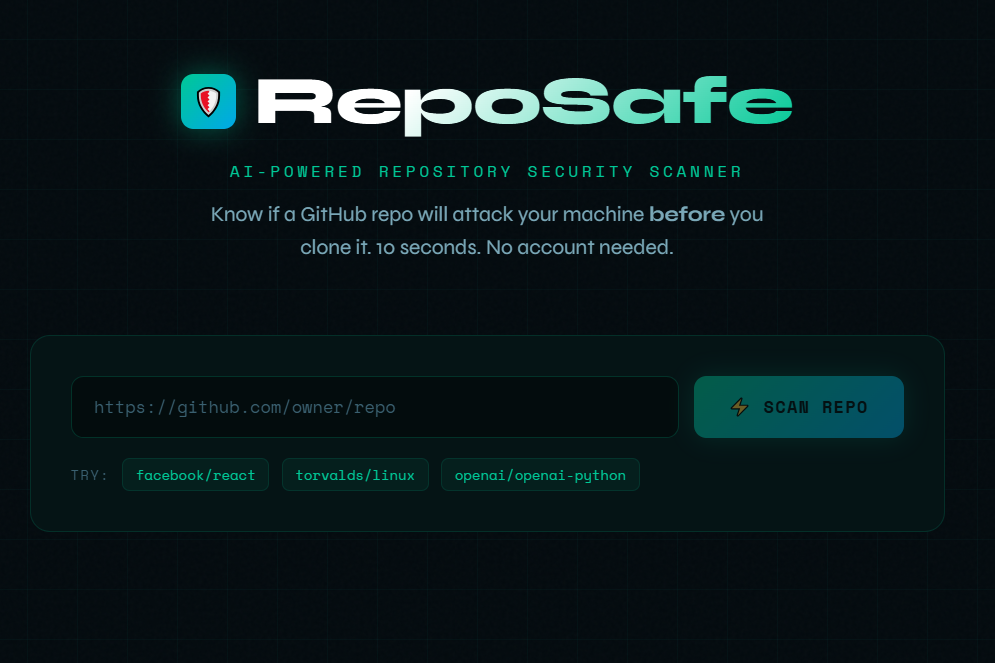
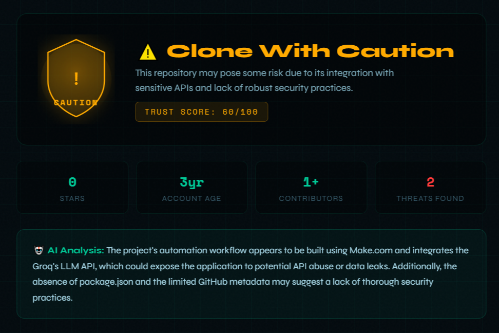
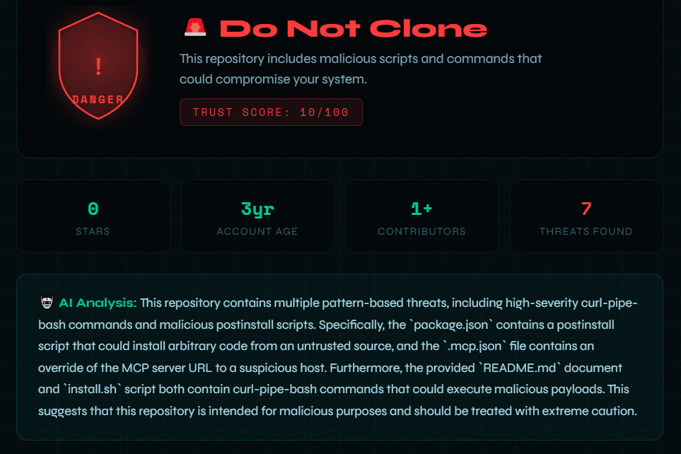
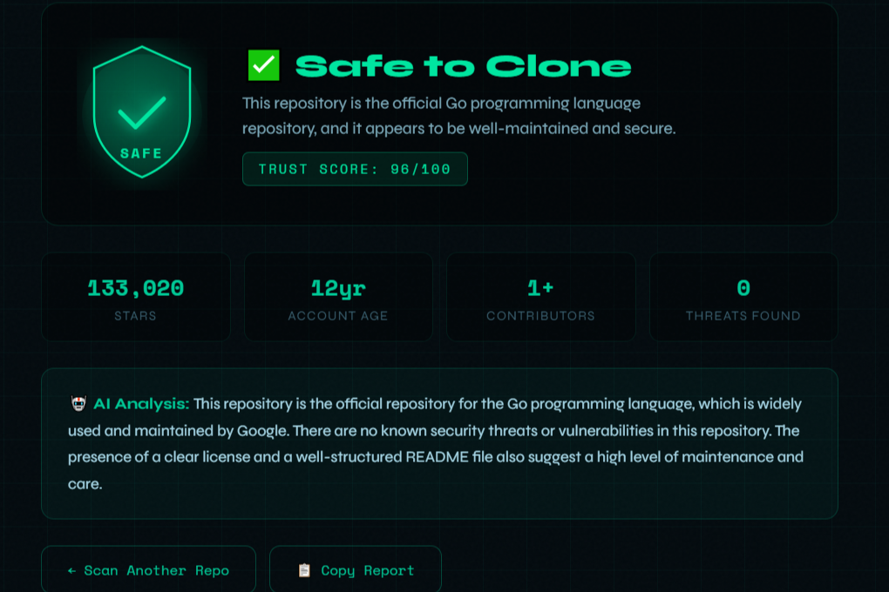

# 🛡️ RepoSafe — Know Before You Clone




> AI-powered GitHub repository security scanner.  
> Know if a repo will attack your machine **before you run a single command.**


---

# 🎥 Demo


*Paste a GitHub repository URL and instantly see if it is safe to clone.*

---

# 🚨 The Problem

Every developer workflow looks like this:

```
Find repository → git clone → open project
```

There is **no safety check between those steps**.

Malicious repositories can hide dangerous behavior in places developers rarely inspect:

- `package.json` install scripts
- `Makefile` commands
- `.mcp.json` configurations
- `.env` examples
- install instructions in README
- GitHub Actions workflows

These scripts can:

- execute shell commands
- download malicious binaries
- exfiltrate API keys
- steal environment variables

Most security tools work **after you’ve already cloned and executed code**.

**RepoSafe adds a security check before the clone.**

---

# ⚡ What RepoSafe Does

Paste any GitHub repository URL.

RepoSafe automatically:

### 1️⃣ Scans repository files

- `package.json`
- `.mcp.json`
- `Makefile`
- `README.md`
- `install.sh`
- GitHub workflows

Detects patterns like:

```
curl | bash
postinstall scripts
credential exfiltration
remote code execution
MCP server overrides
```

---

### 2️⃣ Analyzes repository trust signals

Using the GitHub API:

- repository age
- star velocity
- contributor history
- suspicious forks

Example warning:

```
Account created 3 days ago
847 stars gained overnight
```

---

### 3️⃣ AI security analysis

An AI security agent analyzes:

- install instructions
- configuration files
- detected patterns
- repository metadata

and produces:

```
Trust Score (0-100)
Verdict
Plain-English explanation
```

---

# 🧪 Example Output

```
⚠️ CLONE WITH CAUTION

Trust Score: 60/100

Findings:
🔴 Could potentially expose the application to API abuse or data leaks.
🟡 Absence of 'package.json' and limited GitHub metadata may suggest a lack of good security practices.
```



```
🚨 DO NOT CLONE

Trust Score: 10/100

Findings:
🔴 high-severity curl-pipe-bash commands and malicious postinstall scripts.
🔴 'package.json' contains a postinstall script that could install arbitrary code from an untrusted source
🔴 '.mcp.json' file contains an override of the MCP server URL to a suspicious host.
🔴 'README.md' document and 'install.sh' script both contain curl-pipe-bash commands that could execute malicious payloads.

```



Safe repositories receive:

```
✅ SAFE TO CLONE
```


---

# 🏗️ Tech Stack

| Layer | Technology |
|------|-------------|
| Frontend | Next.js 14 + React |
| API | Next.js Server Routes |
| AI Analysis | Groq API (Llama 3.1) |
| Data Source | GitHub REST API |
| Deployment | Vercel |

Total cost:

```
$0
```

---

# 📦 Installation

## 1️⃣ Clone the project

```bash
git clone https://github.com/shivamgravity/reposafe.git
cd reposafe
```

---

## 2️⃣ Install dependencies

```bash
npm install
```

---

## 3️⃣ Create environment file

Create:

```
.env.local
```

Example:

```
GROQ_API_KEY=your_groq_api_key
GITHUB_TOKEN=optional_github_token
```

Where to get keys:

Groq API  
https://console.groq.com/keys

GitHub Token  
https://github.com/settings/tokens

---

## 4️⃣ Run locally

```bash
npm run dev
```

Open:

```
http://localhost:3000
```

---

# 🧪 Test It

Try scanning:

Safe repo:

```
https://github.com/golang/go
```

Suspicious demo repo:

```
https://github.com/shivamgravity/reposafe-demo-malicious
```

---

# 🚀 Deploy to Vercel

1️⃣ Push the project to GitHub

```bash
git add .
git commit -m "RepoSafe"
git push
```

2️⃣ Go to:

```
https://vercel.com
```

3️⃣ Import your repository and add environment variables:

```
GROQ_API_KEY
GITHUB_TOKEN
```

4️⃣ Deploy 🚀

---

# 📂 Project Structure

```
reposafe
│
├── app
│   ├── page.jsx
│   ├── layout.js
│   └── api
│       └── scan
│           └── route.js
│
├── public
│   ├── banner.png
│   └── demo.gif
│
├── package.json
├── package-lock.json
├── .env.local.example
└── README.md
```

---

# 🛠️ Detection Techniques

RepoSafe combines multiple analysis layers.

### Static Security Analysis

Detects patterns like:

```
curl | bash
wget | sh
postinstall scripts
eval(fetch())
```

---

### Repository Metadata Analysis

Flags suspicious signals:

```
brand new account
unusual star velocity
low contributor count
```

---

### AI Threat Analysis

An AI model analyzes:

- install instructions
- suspicious scripts
- configuration files

to produce human-readable explanations.

---

# 🔐 Security Note

RepoSafe **does not execute repository code**.

All analysis is performed through:

- GitHub API
- static file inspection
- AI reasoning

This ensures scanning itself is safe.

---

# 👨‍💻 Built For

Global Engineering Hackathon

Themes:

```
AI
Developer Tools
Security Automation
```

---

# ⭐ Why RepoSafe Matters

Open-source development relies on trust.

RepoSafe adds a **10-second security check** before developers clone unknown code.

A simple step that can prevent **credential theft, malware, and supply-chain attacks**.
